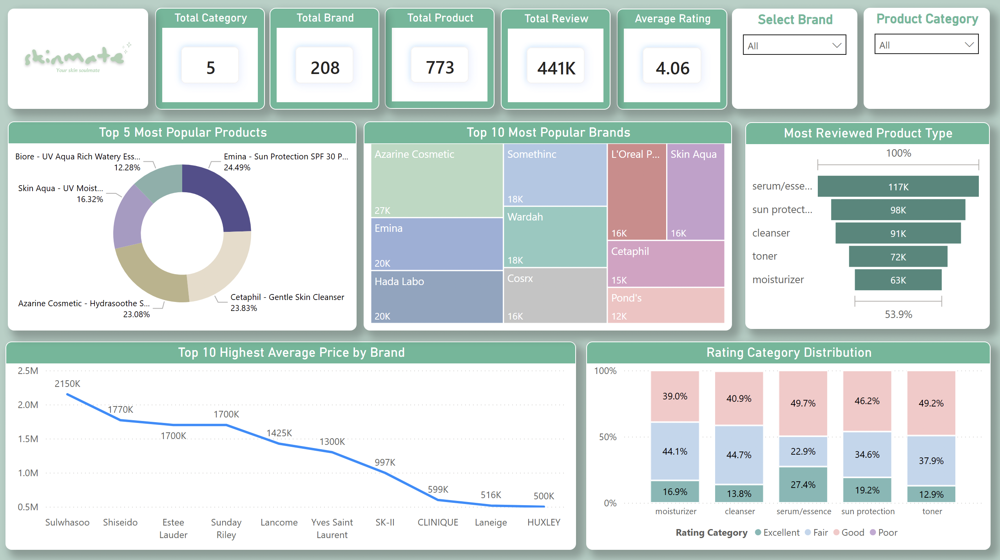

# ✨ **Ade Widya Ningrum — Data Analyst / Data Scientist**

👋 **Hi there!**   

Welcome to my little corner of the data universe.  

I turn messy data into *“Ohhh now I get it!”* moments 💡 and love building solutions that help people make smarter, data-driven decisions.  

With a unique blend of healthcare knowledge and tech implementation experience, I focus on building practical, real-world analytics that actually help people.

---

## 🚀 **What I’m Doing Now**  

📊 Strengthening my expertise in dashboard development (Tableau, Power BI, Streamlit)

🔎 Enhancing my ability to extract actionable insights for business decision-making

🛒 Building deeper domain understanding in e-commerce and market analytics

🧩 Leveraging my healthcare and tech implementation background to support data-driven solutions

---

## 💡 **What I Enjoy**

• Cleaning messy, chaotic datasets until they finally make sense

• Exploring patterns that reveal hidden stories

• Building dashboards that simplify decisions

• Turning data problems into clear, actionable insights

• Creating simple, effective ML models that solve real problems

• Turning data ideas into small apps & tools that people actually use

---

## 🛠 **Skills**

**Programming & Analysis**  
Python • SQL • EDA • Statistical Analysis • Data Cleaning

**Machine Learning & NLP**  
Classification • Feature Engineering • Text Processing • Sentiment Analysis

**Visualization & BI**  
Tableau • Power BI • Matplotlib • Seaborn

**Data Engineering (Basic)**  
Airflow • Docker • PostgreSQL • Elasticsearch • Kibana • BigQuery

---

## 📊 My Dashboard Corner

I love turning raw data into clean, insightful visuals.  
Here’s one example of a dashboard I built:

  

---

## 📫 **Let’s Connect!**

🌐 LinkedIn : [Connect with me](https://www.linkedin.com/in/ade-widya-ningrum-3a0a1b183/)  
📧 Email : me.adewidya@gmail.com

---

Thanks for visiting my data corner!  
I’m always excited to learn, share, and connect with people who love data as much as I do 💛

